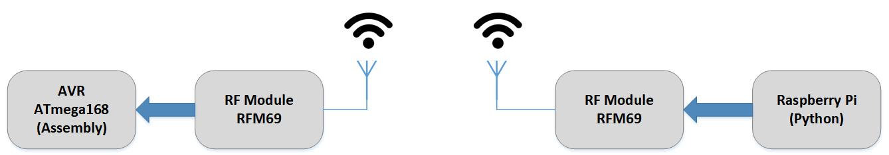

#

#### A demo project of driving RF module RFM69 (433MHz):  
Two RFM69 modules at two endpoints are driven through a Raspberry Pi (model 3B+) single-board-computer running Linux, and an Atmel AVR micro-controller ATmega168pa. At Raspberry Pi end, a Python program drives the RFM module in transmitting mode, and at the ATmega end, programming is developed through Assembly language and drives the RFM module in receiving mode. A 64-byte packet of data is continuously transmitted by Python scripts in Raspberry Pi and the RFM module at AVR side continuously receives data.

#
## Author:
### Hamid Reza Tanhaei
